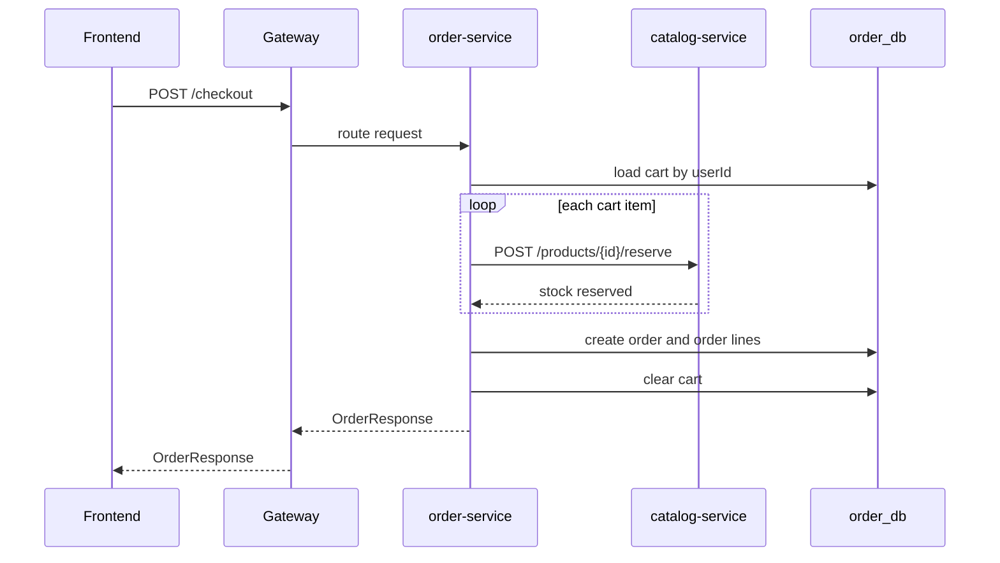
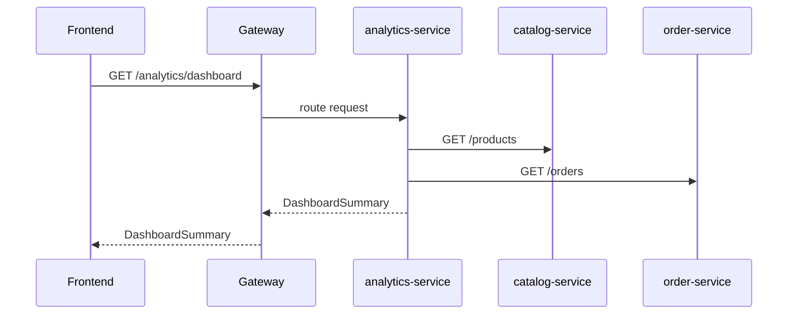

# Smart CommerceOps 架构设计文档

## 1. 项目定位

Smart CommerceOps 是一个轻量电商运营平台，目标是把原始购物车项目升级为可展示现代工程能力的全栈项目。项目重点不是复刻完整 marketplace，而是围绕“客户购物闭环 + 商家运营后台 + 管理员全局视角”建立清晰的业务边界、服务边界和工程规则。

当前项目面向三类角色：

- 客户侧：完成商品浏览、购物车、结算、订单查看。
- 商家/运营侧：维护商品供给、管理库存、处理订单、查看经营指标。
- 管理员侧：具备全局运营视角，当前主要复用商家/运营能力，后续扩展系统级治理能力。

当前不包含完整 marketplace 能力，例如多商户、多店铺、真实支付、物流履约、平台结算、售后退款、复杂促销或会员体系。

## 2. 按角色划分的业务逻辑

### 2.1 客户侧

客户侧目标是完成从浏览到下单的购物闭环。

**注册与登录**

- 客户通过 `identity-service` 注册账号。
- 未指定角色时，默认角色为 `CUSTOMER`。
- 密码使用 BCrypt 哈希后存储。
- 登录成功后返回 JWT access token 和用户资料。
- 前端保存 token 和 user profile，用于后续请求和页面守卫。

**商品浏览**

- 客户通过 `/products` 获取商品列表。
- 当前仅展示 `active = true` 的商品。
- 商品展示字段包括名称、分类、描述、价格、库存、低库存阈值、销量、评分和图片地址。
- 商品主数据归属 `catalog-service`。

**加入购物车**

- 客户选择商品和数量后，前端提交 `userId`、`productId`、`quantity`。
- `order-service` 调用 `catalog-service` 获取商品快照。
- 购物车保存商品名称和单价快照，避免商品后续改价影响购物车显示。
- 当前购物车以 `userId` 作为归属标识，不涉及多设备合并、匿名购物车或跨店铺拆单。

**查看购物车**

- 客户查看当前购物车条目、数量和金额。
- 当前不包含优惠券、促销、会员价、税费、运费或拆单逻辑。

**Checkout**

- 客户提交配送地址和手机号。
- `order-service` 读取用户购物车。
- 对每个购物车条目调用 `catalog-service` 预留库存。
- 库存不足时 checkout 失败。
- 库存预留成功后，`order-service` 创建订单和订单行。
- 订单创建成功后清空购物车。

**查看订单**

- 客户查看自己的订单列表。
- 客户侧通过订单状态理解履约进度。
- 当前不包含退款、售后、物流轨迹或评价闭环。

**联系商家**

- 客户可从商品详情、订单详情、售后详情进入商家会话。
- 会话由 `chat-service` 持久化，前端通过轮询刷新消息。
- 当前只支持纯文本消息，不支持图片、语音、文件或实时 WebSocket 推送。

客户侧不负责：

- 修改商品信息。
- 修改订单状态。
- 查看全局订单和运营指标。
- 管理库存阈值。

### 2.2 商家/运营侧

商家/运营侧目标是维护商品供给、处理订单、监控经营状态。

**商品管理**

- 创建商品。
- 修改商品名称、分类、描述、价格、库存、低库存阈值、active 状态和图片地址。
- 商品与库存主数据归属 `catalog-service`。
- 当前不区分多商家店铺，所有商品属于平台级运营目录。

**库存管理**

- 查看低库存预警。
- 当 `stockQuantity <= lowStockThreshold` 时，商品进入预警列表。
- 补货建议使用当前简单规则计算：`lowStockThreshold * 2 - stockQuantity`，结果不低于 0。
- 当前不包含采购单、供应商管理、仓库调拨或库存流水。

**订单管理**

- 查看订单列表。
- 推进订单状态。
- 正常状态流转为：`PENDING -> PAID -> PROCESSING -> SHIPPED -> COMPLETED`。
- `CANCELLED` 是终态。
- 当前不处理真实支付回调、退款、拆单、物流单号或发票。

**运营看板**

- 查看 GMV、订单数、平均订单金额 AOV、低库存数量。
- 查看热门商品。
- 查看补货建议。
- 当前 dashboard 由 `analytics-service` 同步读取 catalog 和 order 数据后聚合。

**客户会话处理**

- 商家/运营侧可查看自己商户下的客户会话。
- 会话按最近消息时间排序，并展示未读数。
- 商家可回复客户关于商品、订单或售后的纯文本消息。

商家/运营侧不负责：

- 用户账号系统管理。
- 修改用户角色。
- 平台级权限配置。
- 多商家结算和财务对账。

### 2.3 管理员侧

管理员侧目标是具备全局管理能力，但当前实现仍处于轻量阶段。

当前已有能力：

- 以 `ADMIN` 角色登录。
- 访问运营后台页面。
- 查看全局订单、库存预警和 dashboard。
- 使用与商家/运营侧相同的商品、库存、订单管理入口。
- 只读查看全局客户会话，用于轻量审计。

当前待完善能力：

- 角色权限矩阵。
- 用户列表和用户禁用。
- 管理员专属审计日志。
- 操作记录。
- 更细粒度的 RBAC。
- Gateway 或服务端统一鉴权拦截。

管理员侧边界：

- 当前 `ADMIN` 不代表完整后台管理系统。
- 当前不实现租户管理、店铺审核、财务结算或系统配置中心。
- 管理员侧是后续扩展方向，目前主要复用商家/运营侧能力。

## 3. 服务架构

### 3.1 服务列表

| 服务 | 端口 | 职责 |
|---|---:|---|
| `gateway-service` | 8090 | 前端 API 唯一入口、路由、CORS |
| `identity-service` | 8092 | 注册、登录、角色、密码哈希、JWT 签发 |
| `catalog-service` | 8093 | 商品、库存、评分、低库存预警、库存预留 |
| `order-service` | 8094 | 购物车、checkout、订单、订单状态 |
| `chat-service` | 8096 | 客户与商家会话、消息、未读状态 |
| `analytics-service` | 8095 | Dashboard 聚合、热门商品、补货建议 |
| `frontend` | 3000 | React TypeScript 前端 |
| `prometheus` | 9090 | 指标采集 |
| `grafana` | 3001 | 指标展示 |

### 3.2 服务支撑关系

**gateway-service**

- 所有前端请求的唯一入口。
- 根据路径路由到 identity、catalog、order、analytics。
- 当前负责 CORS 和路由。
- 后续可承载统一 JWT 校验和角色访问控制。

**identity-service**

- 支撑客户、商家/运营、管理员三类角色的注册、登录和 token 签发。
- 管理用户账号、密码哈希和角色。
- 不管理商品、订单或运营指标。

**catalog-service**

- 支撑客户侧商品浏览。
- 支撑商家/运营侧商品管理、库存预警和库存预留。
- 商品与库存主数据归属该服务。
- 不直接创建订单。

**order-service**

- 支撑客户侧购物车、checkout、订单查询。
- 支撑商家/运营侧订单状态管理。
- 保存购物车、订单、订单行，以及商品成交快照。
- 不拥有商品主数据。

**chat-service**

- 支撑客户和商家围绕商品、订单、售后进行纯文本会话。
- 拥有会话、消息、已读状态数据。
- 只保存必要上下文快照，不直接读写 identity、catalog、order 数据库。
- v1 使用 REST + 前端轮询，不提供 WebSocket 实时推送。

**analytics-service**

- 支撑商家/运营侧和管理员侧 dashboard。
- 当前通过同步 REST 聚合 catalog 和 order。
- 不参与客户下单主链路。
- 查询失败不应影响用户 checkout 主流程。

## 4. API 与数据流

### 4.1 前端访问规则

前端只访问 gateway：

```text
VITE_API_BASE_URL=http://localhost:8090
```

前端不得直接访问内部服务端口，例如 `8092`、`8093`、`8094`、`8095`。

### 4.2 Gateway 路由

| 路径 | 目标服务 |
|---|---|
| `/auth/**` | `identity-service` |
| `/products/**` | `catalog-service` |
| `/admin/products/**` | `catalog-service` |
| `/admin/inventory/**` | `catalog-service` |
| `/cart/**` | `order-service` |
| `/checkout` | `order-service` |
| `/orders/**` | `order-service` |
| `/chat/**` | `chat-service` |
| `/analytics/**` | `analytics-service` |

### 4.3 Checkout 主链路



### 4.4 Analytics 聚合链路



当前 analytics 是同步实时聚合，不是异步事件 read model。

## 5. 数据边界

每个核心服务拥有自己的数据库 schema：

| Schema | 所属服务 | 主要数据 |
|---|---|---|
| `identity_db` | `identity-service` | 用户账号、邮箱、密码哈希、角色 |
| `catalog_db` | `catalog-service` | 商品、库存、销量、评分 |
| `order_db` | `order-service` | 购物车、订单、订单行 |
| `chat_db` | `chat-service` | 会话、消息、已读状态 |

数据边界规则：

- 每个服务只能直接写自己的 schema。
- 跨服务读取通过 API、事件或只读投影。
- 不允许跨服务直接读写数据库表。
- 订单行中的商品名和成交价是交易快照，不是商品主数据。
- 数据库结构由 Flyway migration 管理。

当前 `analytics-service` 不拥有持久化 read model，只做同步聚合。

## 6. 工程规则

### 6.1 后端规则

- Java 21 + Spring Boot 3.x。
- Controller 不直接暴露 JPA entity。
- API response 优先使用 DTO 或 record。
- Entity 只表达服务内部持久化模型。
- Flyway 管理数据库结构。
- `ddl-auto=update` 不作为长期结构管理方式。
- API shape 变化必须走 `contract-change`。

### 6.2 前端规则

- React TypeScript + Vite + Ant Design + TanStack Query。
- API 类型集中在 `frontend/src/types.ts`。
- HTTP 客户端集中在 `frontend/src/api/client.ts`。
- 前端只调用 gateway。
- 新页面如果依赖新接口，必须先明确 request/response 契约。

### 6.3 协作规则

- Codex 负责后端、Docker、CI、服务集成和总协调。
- Claude 负责前端页面、交互、状态处理和前端文档。
- 跨边界需求通过 GitHub Issue、PR 或 `CONTRIBUTING.md` 的 Sync Log 同步。
- 不依赖聊天记忆作为协作事实来源。

## 7. 后续新增模块原则

### 7.1 先定义角色侧价值

新模块必须先说明它服务哪类角色：

- 客户侧。
- 商家/运营侧。
- 管理员侧。

如果同时服务多类角色，必须分别写清楚不同角色看到的能力、权限和限制。不允许只因为技术栈展示而新增无业务归属的模块。

### 7.2 先定义业务边界

新模块必须说明 In Scope 和 Out Of Scope。

不允许把完整 marketplace 能力悄悄引入轻量运营平台。多租户、支付、物流、退款、结算类能力必须作为独立架构变更评审。

### 7.3 单一数据所有权

- 每个服务只能直接写自己的 schema。
- 跨服务数据通过 API、事件或快照传递。
- 不允许跨服务直接读写数据库表。
- 共享字段只能作为快照保存，例如订单行中的商品名和成交价。

### 7.4 前端只访问 Gateway

- 新页面只能通过 gateway 调后端。
- 新 API 必须更新 `frontend/src/api/client.ts`。
- 新 request/response 类型必须更新 `frontend/src/types.ts`。
- 不允许前端绕过 gateway 直连内部服务。

### 7.5 API 契约先行

- 修改 request/response shape 必须创建或更新 `contract-change`。
- PR 必须写 Frontend Impact 或 Backend Impact。
- 影响另一方工作的变更必须更新 `CONTRIBUTING.md` 的 Sync Log。

### 7.6 DTO 优先

- Controller 不直接暴露 JPA entity。
- 跨服务和前端 API 使用 DTO 或 record。
- Entity 只表达服务内部持久化模型。

### 7.7 主链路保持简单可靠

- v1 checkout 使用同步 REST。
- Kafka 只有在 producer/consumer 落地后才进入默认架构。
- 不提前引入 Saga、服务网格、Kubernetes 或复杂分布式事务。

### 7.8 可运行优先

- 新服务必须接入 Docker Compose。
- 必须暴露 Actuator health。
- 必须说明端口和环境变量。
- 涉及数据库时必须补 Flyway migration。

### 7.9 可测试优先

- 新模块至少覆盖核心业务规则测试。
- 涉及跨服务调用时必须说明失败场景。
- 涉及数据库时优先补 Testcontainers 集成测试。

## 8. 本地运行与观测

Docker Compose 当前启动：

- MySQL
- Redis
- identity-service
- catalog-service
- order-service
- chat-service
- analytics-service
- gateway-service
- frontend
- Prometheus
- Grafana

入口地址：

| 组件 | 地址 |
|---|---|
| Frontend | `http://localhost:3000` |
| Gateway | `http://localhost:8090` |
| Chat Service | `http://localhost:8096` |
| Prometheus | `http://localhost:9090` |
| Grafana | `http://localhost:3001` |

当前 Kafka 不在默认 Compose 中启动，因为事件生产者和消费者尚未实现。

## 9. 当前限制与演进方向

当前限制：

- JWT 只有 access token，没有 refresh token。
- 权限模型较轻，需要补角色级访问控制。
- Analytics 是同步实时聚合，不是异步 read model。
- 没有真实支付、退款、物流、结算。
- 聊天 v1 使用 REST 轮询，仅支持纯文本消息。
- Kafka 依赖不代表已完成事件架构。

后续演进：

- Gateway 或服务端统一 JWT 校验。
- 统一错误响应格式。
- 引入 Kafka 领域事件。
- 引入 analytics read model。
- 聊天升级为 WebSocket/STOMP 实时推送。
- 补 Testcontainers 集成测试。
- 补角色权限矩阵。
